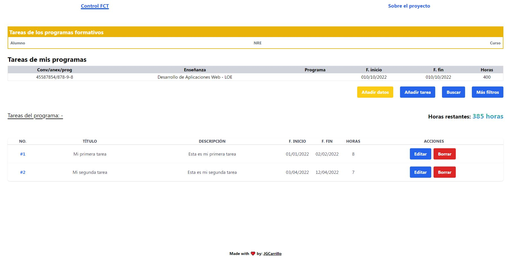

# Control a list of tasks with Vue, Vuex and Vite

    <b>Create, edit and delete a list of task</b>

## Table of contents 👇

- [✨ Main purpose](#-main-purpose)
- [🔥 Set the project locally](#-set-the-project-locally)
- [🚀 Netlify deployment](#-netlify-deployment)
- [🎢 Future improvements](#-future-improvements)
- [🌎 Contact](#-contact)

## ✨ Main purpose

The main purpose of this project was to **learn the basics of Vue**. In this case I wanted to replicate a web application to **add new tasks** to control the user workflow. You can perform several actions which include:

- Add or update the user data
- Add new task
- Search for a specific task by task title
- Filter task by column: number of task, title (alphabetically) or date

This application uses **Vuex** to manage the internal storage of the tasks as well as the user data and the search term input.

## 🔥 Set the project locally

To run the project locally you need to simply do the following:

- `git clone https://github.com/jgcarrillo/fct-control-vuejs.git`
- `npm install`
- `npm run dev`

## 🚀 Netlify deployment

To deploy a **SPA** to Netlify you need to do the following steps:

- Create a new file in _public_ folder called `_redirects`
- Add `/* /index.html 200` to that file content
- In Netlify, set `vite build` and `dist` folder to deploy

You can check [this article](https://www.netlify.com/blog/how-to-deploy-vue-3-and-vite-app-in-5-minutes/) about deployment. If you are not going to use a SPA, you probably don't need to set the **redirects** rule

## 🎢 Future improvements

As I said before, this is a dummy project to lear Vue, so several features could be added in the future to make the app more robust. Probably some of them are:

- [ ] Improve Tailwind CSS, mostly in non-desktop devices
- [ ] Better storage management
- [ ] Add a database (MongoDB, SQLite) to persist data

## 🌎 Contact

If you have some doubts or need to ask something about the project, feel free to reach me here:

- Twitter: [https://twitter.com/jgcarrillo](https://twitter.com/jgcarrillo_)
- LinkedIn: [https://es.linkedin.com/in/jgcarrilloweb](https://es.linkedin.com/in/jgcarrilloweb)
- Website: [https://jgcarrillo.com/](https://jgcarrillo.com/)
- Stackoverflow: [https://stackoverflow.com/users/18326020/jgcarrillo](https://stackoverflow.com/users/18326020/jgcarrillo)
